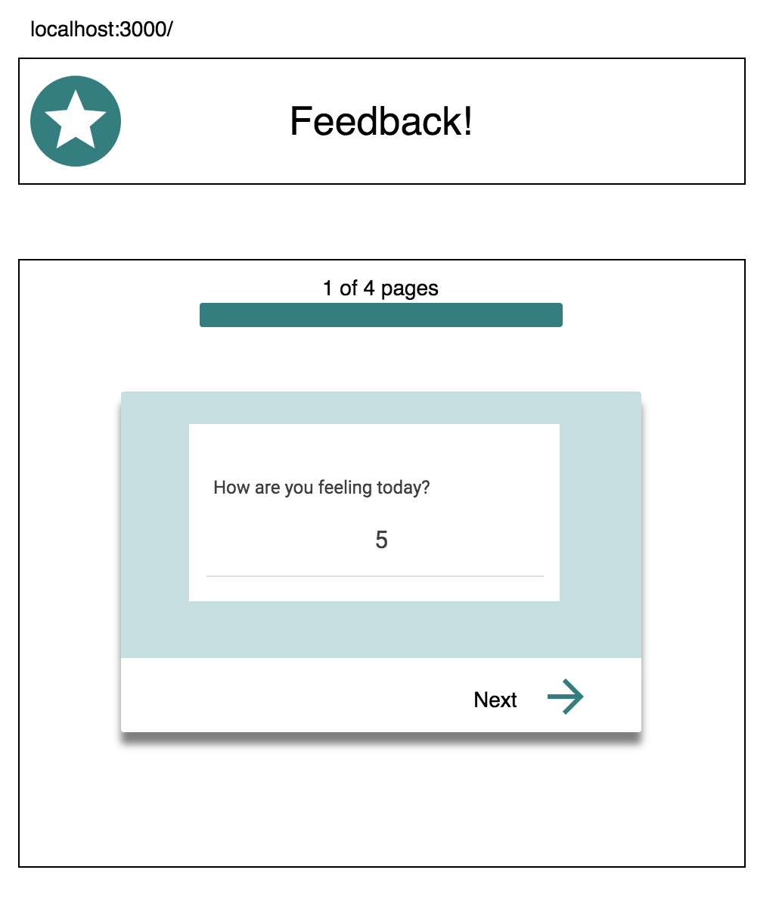
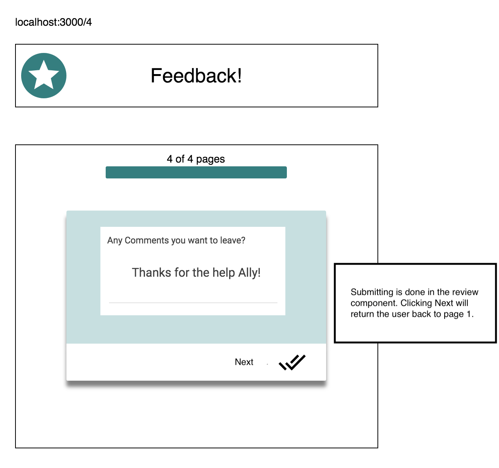
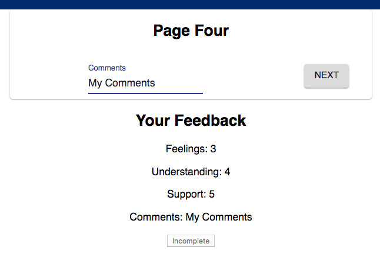
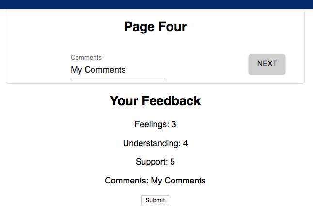

# Redux Feedback Loop

### ADD NEW FEEDBACK

> NOTE: As a baseline requirement, you must use Redux to store your data across views.

Create a multi-part form that allows users to leave feedback for today. 
There will be 4 views for the form parts.
The parts:
- [ x ] How are you feeling today?

-  [ x ]How well are you understanding the content?

- [ x ]How well are you being supported?

- [ x ]Any comments you want to leave?

## THE REVIEW COMPONENT

[ x ] In addition to the multi-step form, the app needs to display the results of each step clearly and at all times. The simplest could be another component on the DOM which shows the results of the current survey and a Submit button.

### Incomplete, Submit button is disabled:
 [ ]

### Survey complete, Submit button is active:
[ x ]

## SUBMIT THE FEEDBACK

 [ ] The `Review` portion needs a submit button which will be clicked on to actually submit the completed feedback to the server. This submit button should only be active when all of the survey steps are complete.

 [ x ]When the submit button is clicked, save the submission in the database. The user should see a submission success page.

